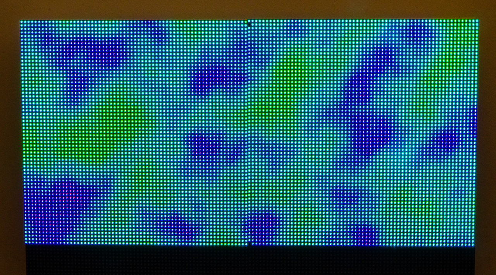

# Hub75Perlin
A quick-and-dirty implementation of Perlin's noise a RP2040 driving Hub75 panels.

Here's what it looks like on 2 64x64 panels chained together.

A lot of the code for driving the panels is lifted from the [pimoroni-pico](https://github.com/pimoroni/pimoroni-pico) library.

The Perlin noise code borrows heavily from [Adrian Biagioli's C# example](http://adrianb.io/2014/08/09/perlinnoise.html), which includes a good description.
